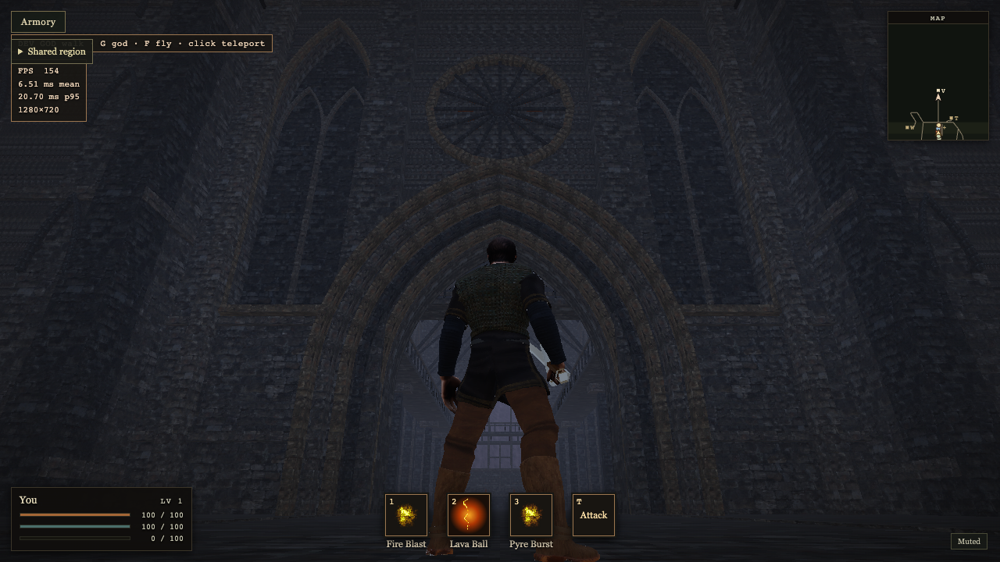

# G02 — Vaelmark bridge and portal composition

The ordinary bridge/entrance views showed a broad, uniform wall and a round main
portal. The preserved `02-cliff-cathedral.png` and `03-fortified-entrance.png`
references call for vertical recesses, projecting masonry and pointed openings.
Root implemented and reviewed this slice in the actual Babylon Lite game.

## Playable change

Paired blind lancets replace the flat side panels with real 0.8 m recesses.
Portal shoulders project another 0.8 m toward the approach; the nave-facing plane
and eight-metre spring clearance stay exact. The portal now has a genuinely
pointed ten-metre crown: the old helper arguments produced a semicircle because
rise equalled half-width. Warm limestone trim distinguishes archivolts, lancets,
rose and front roof verge from the cool wall. Existing batches, textures, shadows,
lights, bridge, primary towers and camera remain in use.

Adjacent arch segments now omit their hidden joint caps while retaining exposed
front/back, soffit, outer surface and impost caps. Convex per-segment winding
remains in use. This shared helper also serves existing chapel/undercroft arches.
The cathedral drops **59,826 → 53,398 render triangles** and **14,600 → 13,556
collision triangles** beneath unchanged 60,000/15,000 guards. Source comments
link the pinned Lite mesh documentation and local design/acceptance reference.
The defensive failed-surface message also uses the existing optional HUD facade,
fixing a stale unbound `combat` reference.

[Geometry and exact packet receipt](geometry.json): required near packet remains
`near-ccb9dc565ff6.br`, **149,963 bytes**, SHA-identical. Final optional skyline:
593,398 encoded bytes; region: 22,364,249 encoded / 157,009,896 decoded bytes,
1,030 blocks; index: 80,357 encoded bytes. Grass and character assets are unchanged.
This is no new one-second startup or slow-link/cache qualification.

[Before facade](facade-before.png), [before bridge](bridge-before.png),
[final bridge](bridge-after.png). Captures are unretouched game output.

## Native acceptance and performance

All **46 focused CPU checks** and the staged Pages build pass. The 14 cathedral
checks cover actual normals/indices, recess/rear-wall depths, new crown aperture,
bridge/floors, doors, headroom, rails and the undercroft opening/terrain clearance.
[Check scope and build profile](checks.json).
All **six final native enter-and-return routes** pass with ordinary W/A/D controls:
undercroft, both bell towers, both chapels, gallery/parapet. Diagnostic placement
occurs only at each route start; Havok stays active and no successful route uses a
recovery teleport. Runtime/GPU errors are empty. [Every route sample](native-traversal.json).

The final built app passes fifteen separate unprofiled windows: M1 Max, system
Chromium WebGPU, uncapped, actual 1280×720/DPR1, seven enemies, three 12-second
runs each. No recording, shader queries, build, asset generation, encoder,
review worker or other active game during timing. Developer and media contexts
close before timing. This is local observed RAF throughput, not GPU-only time,
physical iPhone acceptance or a controlled improvement claim against production.

| route | FPS range | worst p99 ms | worst frame ms |
| --- | ---: | ---: | ---: |
| meadow | 203.6–203.7 | 6.3 | 9.3 |
| town | 193.8–196.6 | 6.4 | 9.0 |
| bridge | 232.3–232.7 | 5.4 | 8.6 |
| cathedral | 222.5–222.8 | 5.5 | 9.4 |
| forest | 209.9–219.1 | 5.7 | 8.9 |

Every window exceeds 144 FPS; zero complete-window pacing flags, intervals over
16.67 ms, errors or recoveries. [All final windows and raw intervals](settled-fps.json),
[compact summary](performance-summary.json). The prior readiness **219.9 ms**
outlier remains unexplained; these clean windows do not establish its cause or fix.

## Motion and review limits

Root reviewed actual bridge/portal/nave/return screenshots and replayed the final
MP4 in owned Edge tab 1147996127; advancing time and original proportions were
observed, and the tab is closed. [Live MP4](https://ve.sparkify.dev/wow-clone/ashen-reach/gothic-exploration/2026-10-09/approach.mp4)
is 1280×720, square pixels, rotation zero, H.264, 37.397925 seconds. All 1,206
source frames retain capture timestamps, with constant viewport/canvas/source
dimensions. [Manifest](capture-manifest.json), [motion controls](motion-controls.json).
VE serves `video/mp4`, exact SHA256 and a correct 206/1,024-byte range response;
system curl verified TLS normally. [Public media receipt](ve-delivery.json).
Telegram delivery and sealed-preview gates are pending this checkpoint; actual
Telegram application fullscreen remains unverified.

[Grok 4.6/high source review](source-review-first-iteration.md) independently
checks generated arch joints, recesses, outward surfaces and doorway clearance.
It reports no blockers. The worker wrote the report then reached its 12-turn cap
(exit 1); this is a complete artifact, not a clean CLI exit or native acceptance.
It covers the first facade iteration, before the final crown correction. Parent
owns final geometry, live routes, timing and media review.

The first iteration's native/FPS receipts remain separately labelled. Motion
review caught its round crown before delivery; the corrected prepared build was
regenerated and the final motion, six routes and fifteen timing windows repeated.
Review close portal geometry before freezing a future bake to avoid this repeat.
The local ignored Dream Loop skill's retrospective links now point to the actual
[completed workflow report](../../complete/reference-led-workflow-2026-09-17.md);
no policy changed, and no ignored personal skill directory is force-added.

## Release and ownership

The implementation is locally verified. Seal/public preview, Telegram ledger and
terminal cleanup are the remaining delivery steps. Production stays under its
independent startup hold. G03 regional exploration is next under the active goal.

Root owns Chrome50982/CDP10037, Vite50933+50957/5873 and the final compiled server
26044/7074. All native contexts close in `finally`; earlier compiled server83111
was stopped after rebuilding. Media31201/7077 and owned Edge1147996127 are closed.
Grok72902 and its MCP children exited. The first preparation74724 and final17458
completed. User Edge15 tabs, regular Chrome New Tab, Orca and unrelated Vite4000
10171+10205 remain intact. Final teardown/accounting follows publication.
