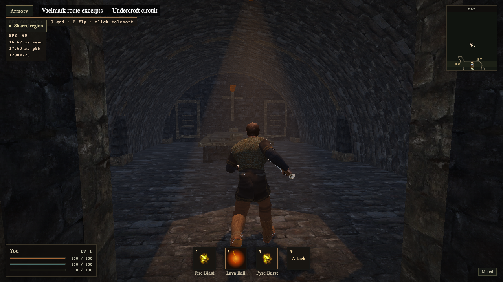

# G01 — Vaelmark undercroft

Implementation **ce0fd03**, verification-helper correction **7698295**, committed
and pushed. The user selected Gothic exploration and deferred mobile on October 8.
This adds a new lower destination to the existing cathedral; it does not recreate
its already accessible chapels, gallery, bell towers or parapet.

## Playable result

The west chapel now has a guarded, 2.8 m wide descent with visible treads and a
smooth Havok ramp, dropping 5.6 m at an 18.23° sustained grade. The lower passage
turns into a pointed-vault chamber with a stone memorial, wall tablets and two
walkable aisles. Four warm fixtures share the existing two local shadow maps.
The same ordinary controls descend, circle the memorial, ascend and leave.
Nearest-light selection considers height, preserving the existing hysteresis so
upper-floor chapel lamps do not displace the nearby undercroft lamps.

The concave foundation and stair aperture use the isolated ISC-licensed Earcut
3.0.1 leaf already in pinned Three 0.180 tooling. No Three renderer is imported,
no dependency was added, and the lockfile is exact. Babylon Lite 1.31.1 owns all
runtime meshes; the existing batch, Gothic arch, worker/prepared packet and Havok
paths remain in use. Thin closed cliff facets replace interior-crossing radial
caps. The visible slab and collision share the same real stair hole. A single
chamber floor collider has the exact outer bounds of its visible tiled floor.
Source comments link the pinned Lite mesh/physics/light documentation and Earcut.

## Native and geometry acceptance

All **22** relevant CPU checks pass: cathedral geometry/budgets, slab opening and
normals, existing stairs/doorways, new headroom/floors/rails, regional collision
and stacked light selection. Both ordinary Vite and staged Pages builds pass;
Pages contains the exact Havok binary. The final cathedral has **59,826 render
triangles / 14,600 collision triangles**, below the existing 60,000/15,000 caps.
The 0.25 m authoring census covers the chamber, corridor, landing and stair
surface; minimum actual terrain clearance is **0.659 m** (guard ≥0.5 m).

[Six native route results](../../../baselines/gothic-exploration/undercroft-2026-10-08/native-traversal.json)
pass with real W/A/D controls, Havok active and no recovery teleports:
undercroft, west bell, east bell, west chapel, east chapel and gallery/parapet.
Each enters and returns; runtime and GPU error arrays are empty. Diagnostic
placement happens once at each route start; no placement/recovery occurs during
successful traversal. God mode changes damage only; flying is false.

Grok 4.6/high independently reviewed geometry and selection logic. Its valid
finding was incomplete future terrain protection outside the chamber. Root
expanded the census over every lower floor and stair surface and added the
corridor-intrusion regression. Static review is not native acceptance; root
checked the actual route evidence and live motion.

The required near/start packet is **149,963 bytes**, byte-exact before/after,
with unchanged texture URLs. Only the optional skyline packet changes:
**593,607 → 593,696 bytes (+89)**. Character manifests and assets stay exact.
All five mesh attribute/index batches are SHA-identical between the initially
used standalone Earcut and the final reused leaf. The standalone dependency was
removed. [Geometry/packet receipt](../../../baselines/gothic-exploration/undercroft-2026-10-08/geometry.json).
Byte equality does not establish a new one-second cold-start result.

## Performance

Qualified local source **7698295** passes all **18** windows above both the
144 FPS target and >120 FPS floor. System Chromium **154.0.8037.98**, Apple M1
Max, WebGPU, actual 1280×720/DPR1, seven enemies, three 12-second windows per
route, uncapped flags, queries disabled, no recording/build/encoding/other game.
Every region row asserts actual query/resolution/Havok/enemy/recovery state.

| route | FPS range | worst p95 ms | worst p99 ms | worst frame ms | >16.67 ms |
| --- | ---: | ---: | ---: | ---: | ---: |
| meadow | 195.3–195.4 | 6.2 | 6.5 | 13.6 | 0 |
| town | 195.8–195.9 | 5.7 | 6.4 | 9.0 | 0 |
| bridge | 234.7–235.0 | 5.2 | 5.4 | 11.1 | 0 |
| cathedral | 223.5–224.1 | 5.2 | 5.4 | 10.7 | 0 |
| forest | 211.1–221.4 | 5.5 | 5.6 | 10.9 | 0 |
| undercroft | 198.4–198.8 | 6.2 | 6.5 | 21.3 | 1 |

The 38,430 region intervals have no frames over 16.67 ms. The 7,154 undercroft
intervals contain **one 21.3 ms outlier** in run 1; runs 2/3 worst frames are
8.9/9.0 ms. All three circuits move 52.0–53.0 m using real keyboard steering,
with zero recoveries/errors. This controller samples state and changes keys
during measurement, adding driver overhead; it is not identical to the passive
region controller. The outlier remains a tail follow-up if reproducible; without
a corresponding trace it does not establish a runtime cause or justify a
speculative optimization. This is not a spike-free claim.

No complete-window pacing flags occur in any of the 18 windows; region HUD
rolling hints also remain false. These are observed RAF intervals on this
machine, not a guarantee of other hardware, display refresh or GPU-only time.
The earlier 202.6–232.6 production observations and 203.0–237.1 maximum-outfit
observations used timestamp queries and different build/outfit inputs; this
unprofiled default-Human Vite pass is not a controlled regression pair.

[All qualified and aborted receipt rows](../../../baselines/gothic-exploration/undercroft-2026-10-08/performance.json),
[every raw frame interval](../../../baselines/gothic-exploration/undercroft-2026-10-08/frame-intervals.json).

The first pass was deliberately interrupted after five recorded windows because
the old region helper added `gpuTiming=`. `main.js` checks presence, so this enabled
queries and contradicted the stated unprofiled conditions. Its diagnostic rows
are preserved; they are not accepted unprofiled measurements. The helper now
removes the flag and asserts the actual runtime state. Historical receipts with
that parameter retain their observed values with queries enabled; they do not
prove unprofiled maximum throughput. No runtime optimization follows from this
verification defect alone.

## Reviewed motion and delivery

[Live MP4 — west chapel, undercroft circuit and return](https://ve.sparkify.dev/wow-clone/ashen-reach/gothic-exploration/2026-10-08/undercroft-ce0fd03.mp4)
was root-reviewed through actual playback and representative source frames, then
sent using `tg file` as **Telegram 890**. The capture is **1280×720**, square pixels,
rotation zero, **32.563 s**, with constant viewport/canvas/source-frame dimensions
and capture-timestamp timing. All 1,759 received frames retained, zero reordered.
Recording was capped and is visual evidence, not an FPS measurement. The final
floor-collider consolidation has the same visible surface and is independently
covered by the final six native routes.

Telegram returned 1280×720 and the expected rounded **33-second** duration.
Telegram Web inline and expanded
playback preserve the proportions; direct VE plays at 1280×720 with advancing
time. Actual Telegram application fullscreen remains unverified. VE is
`video/mp4`, **14,664,093 bytes**, exact SHA-256 match to the local file, with a
verified 206 byte-range response for seeking.
[Capture manifest summary](../../../baselines/gothic-exploration/undercroft-2026-10-08/motion.json),
[delivery receipt](../../../baselines/gothic-exploration/undercroft-2026-10-08/delivery.json).

## Limits, corrections and workflow

The first pitched ceiling/dark-turn trial failed root visual review; it was
replaced with a continuous pointed vault and turn light before the delivered
capture. An earlier native regression was interrupted by our Vite source edit
and `ASHEN` disappeared. The failure is retained; the qualified six-route run
uses frozen inputs and passes. Freeze **source and prepared public inputs**
until a live check finishes, and run prepare → build sequentially. Concurrent
prepare/build initially consumed stale data; those failed build logs remain
alongside the final passing builds. These are workflow failures, not clean passes.

## Sealed preview and cleanup

[Immutable desktop preview](https://f51c7bcb.fardel.pages.dev/?play&clean), source
**7698295**, uses the current four-flag saved-bootstrap/primed-world/lazy-buffer/
covered-hair Pages profile. All **646** decoded served-byte/MIME checks pass,
including both entry aliases, Havok, the updated optional packet, mutable indices
and missing-path 404 controls. **320 declared cache checks** pass; **326 responses
without a declared custom policy remain unclassified**, not newly qualified cache
rules. Native prepared-world undercroft traversal then enters and returns through
42 samples with Havok active, zero recoveries and empty runtime/GPU error arrays.
This does not constitute cold-start, physical mobile or production acceptance.

Seal `7b366bd57343545f69a51b4b9148dda699e8774ce87b8ef3630935a89841ccaf`
pins 643 build files and 1,231 committed product inputs. Upload used those exact
bytes without rebuilding. [Seal](../../../baselines/gothic-exploration/undercroft-2026-10-08/preview-seal.json),
[served rows](../../../baselines/gothic-exploration/undercroft-2026-10-08/preview-delivery.json),
[native route](../../../baselines/gothic-exploration/undercroft-2026-10-08/preview-native.json).
Cloudflare's canonical deployment API confirms production stays **5723a4ab /
7d00c56**. The preview is not a promotion.

All owned game/browser/controller/Vite instances are stopped. Final preview used
Chrome 24817 / Vite 24772, CDP10037 / Vite5873; qualified FPS used Chrome8850 /
Vite8805, controller8758. Earlier root capture Chrome75192/Vite75079 and baseline
Chrome42486/Vite42435 are also stopped. Both owned VE playback tabs are closed;
Telegram media review is stopped. User Edge2931/Orca98938 and twelve nongame tabs
remain intact. [Ownership events](../../../baselines/gothic-exploration/undercroft-2026-10-08/ownership.jsonl).

The current production deployment remains **5723a4ab / 7d00c56** until its separate
sealed release gates are satisfied. G01 local acceptance does not resolve the
older required-texture startup cause or the backlogged iPhone graphics-device
loss. Do not repeat unchanged startup campaigns merely to ship this slice.
The following focused slice is G02, bridge/portal composition and masonry against
the preserved Gothic references; regional destination readability follows in G03.
